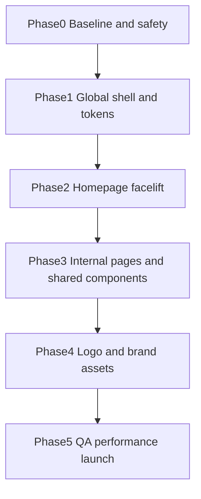

# Facelift Implementation Plan

## Objective
Implement a professional, conversion-first visual facelift inspired by `imamerima.com` without breaking current content workflows.

## Guiding Constraints
- Keep Jekyll architecture and include composition.
- Avoid large risky rewrites; ship in controlled phases.
- Preserve existing content and URLs.
- Improve quality and consistency first, then add enhancements.

## Phase 0: Baseline and Safety
- Create branch for facelift execution.
- Capture before screenshots (desktop + mobile for key pages).
- Define regression checklist for:
  - homepage
  - workshops/projects
  - store listing/item
  - reviews
  - contact

## Phase 1: Global Shell and Tokens

### Files
- `_includes/head.html`
- `_layouts/default.html`
- `_includes/header.html`
- `_includes/footer.html`
- `_sass/0-settings/_variables.scss`
- `_sass/0-settings/_color-scheme.scss`
- `_sass/3-modules/_header.scss`
- `_sass/3-modules/_footer.scss`
- `_sass/3-modules/_buttons.scss`
- `_sass/3-modules/_sections.scss`

### Tasks
1. Introduce v2 semantic tokens (color, spacing, radius, shadow, type scale).
2. Apply typography scale and rhythm globally.
3. Redesign header (desktop + mobile drawer interactions).
4. Redesign footer into utility-rich structure.
5. Normalize button variants and interaction states.

### Exit Criteria
- Header/footer match new visual direction on desktop/mobile.
- Section rhythm and typography are visibly consistent.
- No functional regression in navigation or links.

## Phase 2: Homepage Facelift

### Files
- `index.html`
- `_includes/section-hero.html`
- `_includes/section-projects.html`
- `_includes/section-testimonials.html`
- `_includes/section-accordion.html`
- `_includes/section-instagram.html`
- related module SCSS files

### Tasks
1. Reorder/retune homepage flow to match conversion hierarchy:
   - value -> trust -> offer -> proof -> FAQ -> CTA.
2. Upgrade hero and section shells for premium hierarchy.
3. Refine reviews presentation with stronger typography and card polish.
4. Remove inline styles from homepage blocks.

### Exit Criteria
- Homepage visually aligns with wireframe.
- Mobile hierarchy is clear without excessive scrolling confusion.
- CTA visibility improves across page flow.

## Phase 3: Internal Pages and Shared Components

### Files
- `_layouts/page.html`
- `_layouts/project.html`
- `_layouts/store-item.html`
- `_sass/3-modules/_projects.scss`
- `_sass/3-modules/_recommendations.scss`
- `_sass/4-layouts/_store.scss`
- `_pages/reviews.md` and related section includes

### Tasks
1. Build shared card primitive and migrate project/recommendation/store cards.
2. Align service/internal pages with same section/title/CTA language.
3. Improve product and service page trust blocks and readability.
4. Standardize metadata and badges (stock, limited, featured).

### Exit Criteria
- Card systems are consolidated and visually consistent.
- Internal pages look like one cohesive brand system.

## Phase 4: Logo and Brand Assets

### Files/Assets
- `images/logo-*` (new variants)
- `_data/settings.yml` (logo references)
- `_includes/header.html`
- `_includes/footer.html`

### Tasks
1. Choose logo route (recommended: monogram + wordmark).
2. Export responsive logo set (primary/horizontal/icon/light).
3. Integrate logo variants by context (header/footer/favicon).

### Exit Criteria
- Logo is crisp in desktop/mobile and dark/light surfaces.
- Brand feels distinct but aligned with premium target.

## Phase 5: QA, Performance, and Launch

### QA Checklist
- Desktop: 1440, 1280
- Tablet: 1024, 768
- Mobile: 430, 390, 360
- Browsers: Chrome, Safari, Edge

### Functional Checks
- Navigation open/close + dropdown behavior
- WhatsApp/contact CTA links
- Form behavior
- Store and project routing
- Reviews visibility and media loading

### Visual Checks
- No overflow/horizontal scroll bugs
- Typographic hierarchy consistency
- Section spacing consistency
- Contrast/focus states

### Performance Checks
- Image size sanity (avoid oversized hero/gallery payloads)
- Layout shift checks for image-heavy sections

## Rollout Diagram

## Risks and Mitigation
- Risk: visual regressions from token changes.
  - Mitigation: phase-by-phase screenshot checks.
- Risk: mobile nav regressions.
  - Mitigation: isolate header changes and test early in phase 1.
- Risk: style duplication remains.
  - Mitigation: enforce shared card primitives before phase completion.

## Acceptance Criteria
- New visual system is implemented consistently across home + internal pages.
- Header/footer/mobile behavior reflects premium benchmark quality.
- Reviews, workshops, and store feel like one coherent product.
- Codebase styling debt is reduced (fewer inline styles, fewer duplicate card rules).
